## Descripcion del proyecto
Este proyecto (escolar) esta creado con Java en el cual se desarrollo un sistema 
de control de reservaciones, control de acceso para empleados empleados y control de pagos para 
un hotel, las carpetas de estre proyecto estan organizadas siguiendo MVC para poder tener un mejor orden de los archivos. Cuenta con una interfaz grafica y conexion a base de datos SQL.

**ADMINISTRACION HOTEL (JAVA).**
==
Sistema para llevar la administracion de un hotel.
El sistema unicamente esta pensado para el personal del hotel en el cual hay diferentes puestos y cada uno de ellos podra realizar diferentes tareas.
Los puestos que se planean cubrir son los siguientes. 
|Puesto|Actividades|
|------|-----------|
|Director General| Reservaciones, registro de clientes, registro de habitaciones, registro de servicios, registros de trabajadores, consultar pagos|
|Subgerente|Reservaciones, registro de clientes, registro de trabajadores, consultar pagos|
|Recepcionista| Reservaciones, registro de clientes, consultar pagos|

Tambien existie un apartado para el cliente en el cual puede iniciar sesion y consultar los pagos que ha realizado.
Todas estas actividades se pueden ver en los siguientes diagramas de flujo.

## Estructura del proyecto
---

## Base de datos.
---
El sistema hace uso de una BD sencilla la cual se puede visualizar en el siguiente modelo ER.
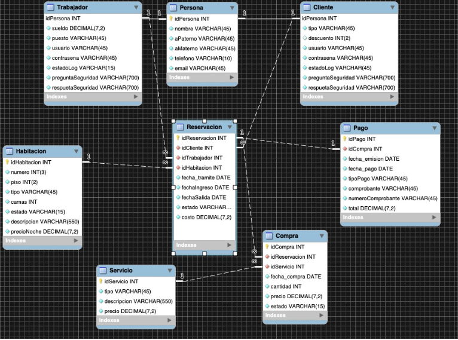

para crear el esquema se debera ejecutar el script que se encuentra en **BD/DBH.sql**. 

## Instalacion.
---
#### Base de datos
Para poder instalar la base de datos existen dos caminos, crear un contenedor desde cero o agregar la base de datos en un contenedor existente.

###### Nuevo contenedor
Para instalar la base en un nuevo contenedor se deben seguir los siguientes pasos:
1. Obetner imagen mysql:5.7. `docker pull mysql:5.7`
2. Crear un contendor a partir de la imagen obtenida, se puede consultar la propia documentacion
de mysql para poder personalizar la creacion.
`docker run -p 3307:3306 --name BDHotelJava -v <dirHost>:/var/lib/mysql -e MYSQL_USER=JohanZR -e MYSQL_PASSWORD=1602J -e MYSQL_DATABASE=Hotel -e MYSQL_ALLOW_EMPTY_PASSWORD=yes -d mysql:5.7`
donde: 
**dirHost:** directorio en el equipo host para persistir la informacion de la BD
3. Copiar el script DBH.sql dentro del contendor, se recomienda hacerlo en /tmp/ `docker cp <dir>/BD/DBH.sql BDHotelJava:/tmp/`
4. Ingresar al contenedor con el comando `docker exec -it BDHotelJava /bin/bash` 
5. Conectarse a mysql `bash-4.2# mysql -u JohanZR -p`
6. Ejecutar el script para crear la base de datos `mysql> source /tmp/DBH.sql`

###### Contenedor existente
Para instalar la base en un contenedor existente, asuminedo que el contenedor esta creado con mysql:5.7 y cuanta con credenciales para el usuario root, se deben seguir los siguientes pasos:
1. Copiar el script DBH.sql dentro del contendor, se recomienda hacerlo en /tmp/ `docker cp <dir>/BD/DBH.sql BDHotelJava:/tmp/`
2. Ingresar al contenedor con el comando `docker exec -it <containerName> /bin/bash`
3. Conectarse a mysql `bash-4.2# mysql -u root -p`
4. Importar la base de datos del proyecto `mysql> source /tmp/DBH.sql`
5. Realizar la creacion del usuario JohanZR `create user JohanZR identified by '1602J';`
6. Dar privilegios al usuario JohanZR para acceder a la base `grant all privileges on hotel.* to JohanZR;`

Con estos pasos la base de datos utlizada por el sistema esta lista, sin embargo, es recomendable instalar algun cliente para poder conectarse a la BD desde el quipo host. Una opcion para esto es mysql workbench

1. Una vez instalado el cliente, generar conexion con BD.
Para ello en workbench se debera crear una conexion con las siguientes caracateristicas
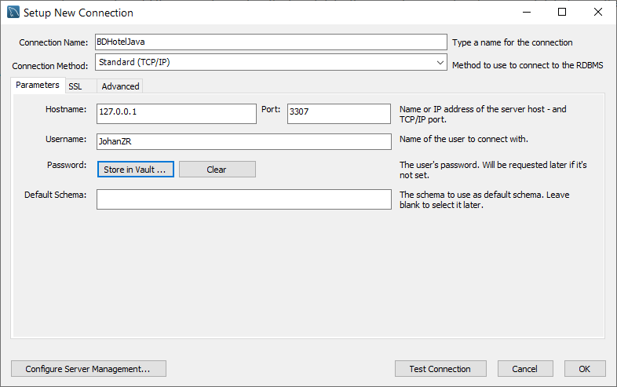
Si la conexion es exitosa se mostrara un mensaje como el siguiente:
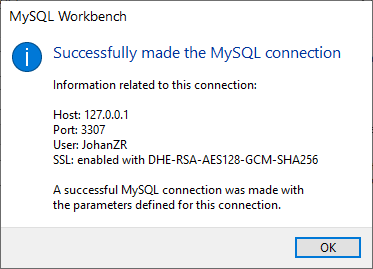

1. Una vez creada la conexion podremos ver nuestras tablas creadas desde la interfaz grafica, asi como realizar consultas, editar datos e inclusive editar las tablas.
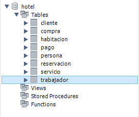

#### Sistema Java

Dentro de la carpeta **ejec** se encuentra el archivo **Hotel.jar**, este es un ejecutable del proyecto, basta con hacer dobke click sobre el o ejecutar el comando `java -jar Hotel.jar` estando dentro de la carpeta que lo contiene.

## Manual de uso
---
Al iniciar el sistema veremos la siguiente pantalla.
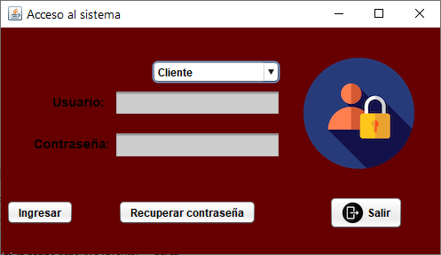

De inicio existen algunos datos almacenados en la BD, entre estos datos hay 3 empleados registrados.

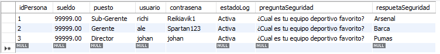

Debido a que cada uno tiene un puesto diferente no podran realizar, o no tendran acceso, a los mismos apartados del sistema. Para poder verificar el funcionamiento de todos los apartados se utilizara al usuario con puesto de director.

Al acceder veremos la pantalla de inicio y arribas un menu donde podremos realizar las diferentes actividades segun el puesto del usuario.
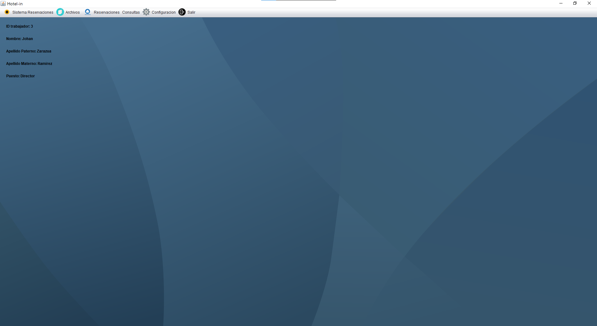

###### Registro de habitaciones y servicios
Estas actividades las podemos encontrar en la opcion Archvios del menu de opciones, dentro de ellas se podra ver el listado de los registros actuales del lado derecho.

Para crear un nuevo registro es necesario dar click sobre el boton con la leyenda "Nuevo", esto habilitara el formulario para ingresar los datos. Una vez que se llenen los datos se pueden guardar con el boton "Guardar".
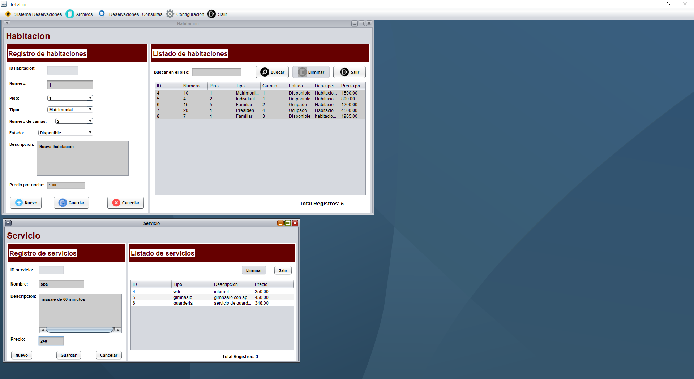

Si el registro se realiza correctamente se mostrara un mensaje como el siguiente.
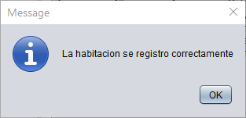

Al cerrar el mensaje el listado se actualizara para mostrar el nuevo registro.
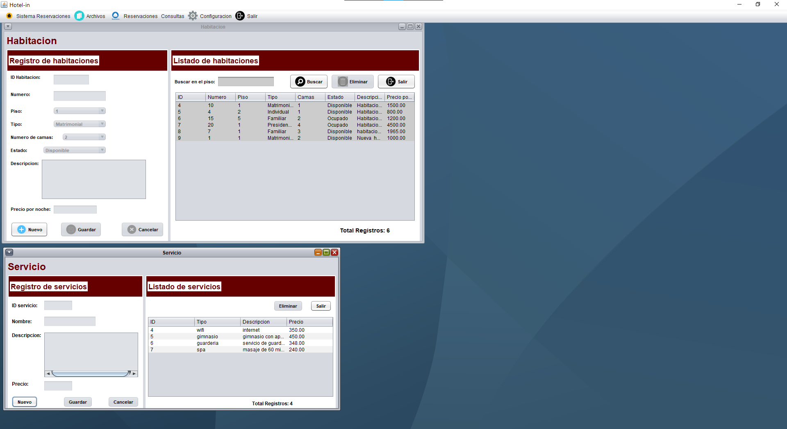

Para poder actualizar algun registro solo se debe dar doble clic sobre la fila que se desea editar en el listado de registros, automaticamente cargara los datos en el formulario y habilitara los campos para editar los valores
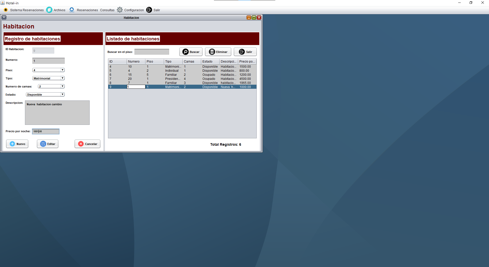
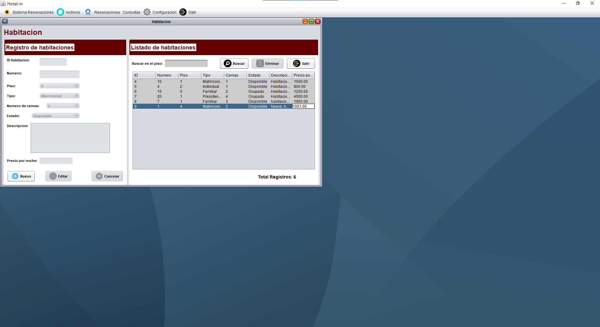

En general la mayoria de apartados funcionan de la misma manera, sin embargo, hay algunos casos que tiene funcionalidades extra los cuales se mencionan a continuacion.

###### Rservaciones
En la vista de reservaciones hay dos botonoses adicionales "Compras" y "Hacer pagos". El primero de ellos nos permite ver las compras adicionales de la reservacion, es decir, los servicios extra que decidio contratar, ademas de poder agregarle mas servicios en caso de ser necesario. El segundo nos permite realizar pagos de la reservacion o los servicios contratados.

Para entrar a las compras hay que dar click sobre la fila y posteriormenmte sobre el boton "Compras", esto abrira una nueva ventana donde se podra manipular esta informacion
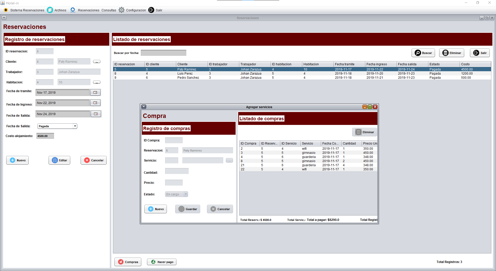

En el caso de pagos se debe seguir el mismo proceso, dar clic sobre la fila y posteriormente sobre el boton para poder abrir la nueva vista.
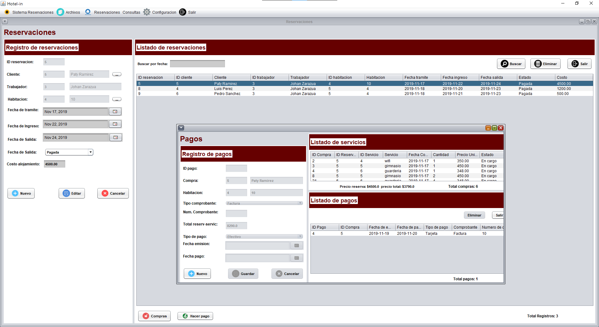

###### Tickets y facturas
Al momenmto de realizar un pago se crea un ticket o factura del pago, posteriormente se pueden consultar dichos documentos, esta funcionalidad se encuentra en la opcion "Consultas" del menu. Al ingresar nos pedira que indiquemos que tipo de comprobante deseamos consultar y posteriormente indicar el ID de la reservacion.
Si el ID es correcto abrira un explorador de archivos para indicar donde almacenara el archivo.
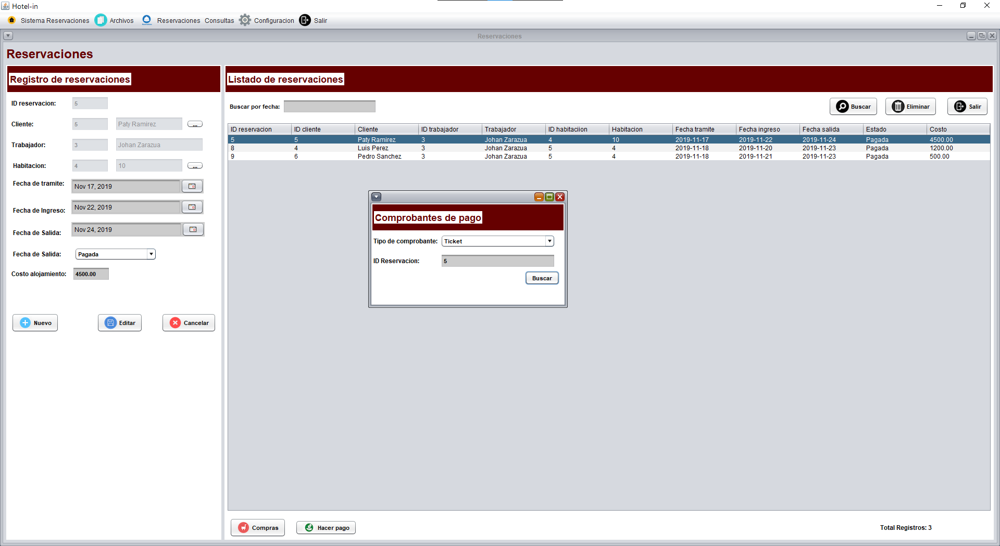 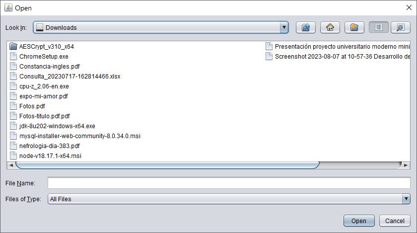

Al seleccionar el archivo lo abrira con la aplicacion predeterminada del sistema
