**ADMINISTRACION HOTEL (PHP).**
==
El poryecto es un sistema web el cual permite llevar la administracion de un hotel.
Dentro de este sistema web es posible administrar diferentes areas del hotel como 
los usuarios (empleados), habitaciones, servicios, reservaciones y clientes que se han
registrado en el hotel.
En la mayoria de las areas mencionadas se implemneta un CRUD para poder genera registros, 
actualizarlos, eliminarlos o consultarlos.

La instalacion de este proyecto se hace mediante dos conteneores. 
El primer contendor se crea mediante la imagen mysql:5.7 y es el que tendra la instalacion
de la base de datos, mientras que el segundo se crea con php:7.0-apache el cual sera un servidor
php apache que contendra el codigo fuente del sistema.

## Base de Datos. 
---

Para poder utilizar el sistema se creo una base de datos simple, la cual se ve de la siguiente manera
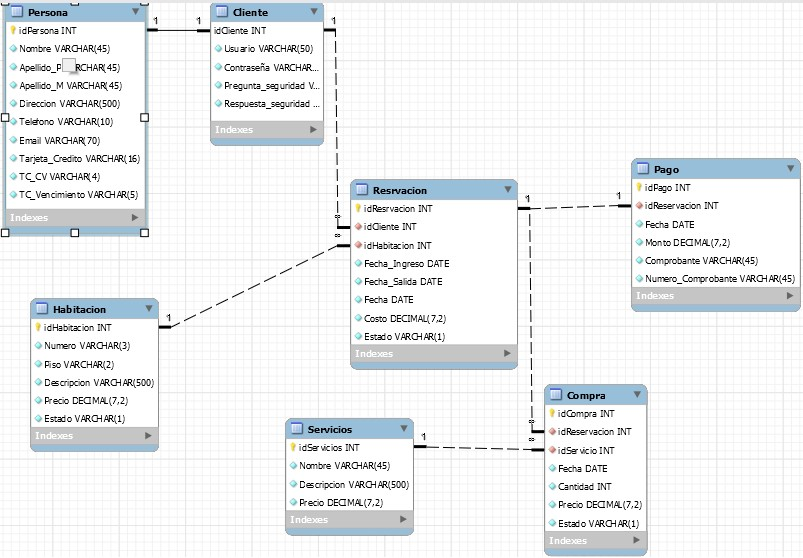

Esta base de datos se creara en mysql, para poder crear los objetos el proyecyo cuenta con
uns script que se encuentra en /BD/scripts/hedm.sql. Este script debera importarse en la BD
para poder generar las tablas, restricciones y datos iniciales.

## Instalacion
---

#### Base de datos

Para poder instalar nuestra base de datos se deben seguir los siguientes pasos
1. Obetner imagen mysql:5.7. `docker pull mysql:5.7`
2. Crear un contendor a partir de la imagen obtenida, se puede consultar la propia documentacion
de mysql para poder personalizar la creacion.
`docker run -p 3306:3306 --name BDHotel -v <dirHost>:/var/lib/mysql -e MYSQL_ROOT_PASSWORD=<password> -d mysql:5.7`
donde: 
**dirHost:** directorio en el equipo host para persistir la informacion de la BD
**password:** password del usuario root para la BD
3. Copiar el script hedm.sql dentro del contendor, se recomienda hacerlo en /tmp/ `docker cp <dir>/hedm.sql BDHotel:/tmp/`
4. Ingresar al contenedor con el comando `docker exec -it BDHotel /bin/bash` 
5. Conectarse a mysql `bash-4.2# mysql -u root -p`
6. Ejecutar el script para crear la base de datos `mysql> source /tmp/hedm.sql`

Con estos pasos la base de datos utlizada por el sistema esta lista, sin embargo, es recomendable instalar algun cliente para poder conectarse a la BD desde el quipo host. Una opcion para esto es mysql workbench

1. Una vez instalado el cliente, generar conexion con BD.
Para ello en workbench se debera crear una conexion con las siguientes caracateristicas
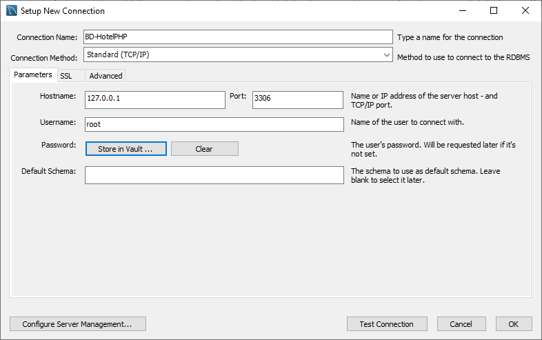
Si la conexion es exitosa se mostrara un mensaje como el siguiente:
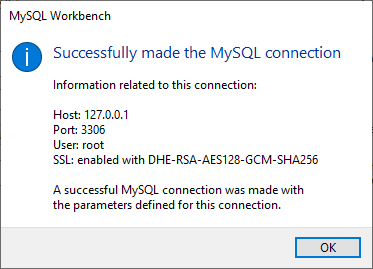

2. Una vez creada la conexion podremos ver nuestras tablas creadas desde la interfaz grafica, asi como realizar consultas, editar datos e inclusive editar las tablas.
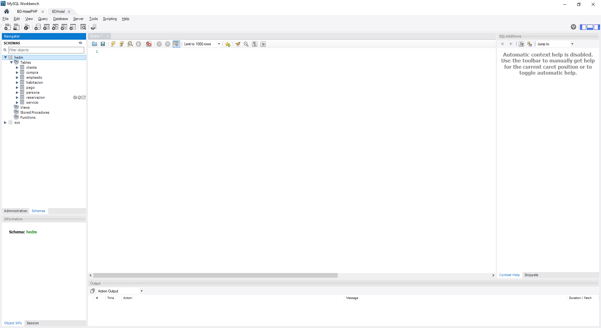

#### PHP Apache

El proyecto cuenta con un archivo Dockerfile, este se encarga de generar una imagen con lo necesario para alojar el sistema. Este Dockerfile se basa en la imagen php:7.0-apache ya que se generara un servidor con apache. Para poder iniciar el sistema se deben seguir los siguientes pasos

1. Construir la imagen mediante el Dockerfile. Estando en la carpeta principal del proyecto ejecutar `docker build -t hotelphp:1.0 .`. Esta imagen tambien se encuentra a docker hub por lo que es posible descragarla con el comando `docker pull johanzr/hotelphp:1.0`
2. Crear el contenedor con el comando `docker run -p 8083:80 --name HotelPHP -d --link BDHotel hotelphp:1.0`
3. Ingresar a un navegador y validar que se ve la pagina principal del sistema.


<!-- 4. Obetner imagen mysql:5.7. `docker pull php:7.0-apache`
5. Crear un contendor a partir de la imagen obtenida 
`docker run -p 8080:80 -v <dirDownload>\SchoolProjects\adminHotelPHP:/var/www/html --name web-HotelPHP -d --link BD-HotelPHP php:7.0-apache`
donde: 
**dirDownload:** directorio en el equipo host donde se haga la descarga del proyecto.

1. Una vez que el contenedor esta corriendo se debe ingresar a el mediante una terminal
`docker exec -it web-HotelPHP /bin/bash`
1. Instalar extensiones necesarias para el proyecto 
`docker-php-ext-install mysqli` `docker-php-ext-install pdo_mysql`. Cuando terminen de instalar mostrara
la ruta en la cual se instalaron las extensiones, la salida tiene el siguiente formato
```
Installing shared extensions:     /usr/local/lib/php/extensions/<dirExtensions>/
```

1. Modificar los archivos ini de php, estos se encuentran en **/usr/local/etc/php**. 
En la seccion **Dynamic Extensions** se debera agregar lo siguiente
```
extension=/usr/local/lib/php/extensions/<dirExtensions>/msqli.so
extension=/usr/local/lib/php/extensions/<dirExtensions>/pdo_mysql.so
extension=/usr/local/lib/php/extensions/<dirExtensions>/opcache.so
extension=/usr/local/lib/php/extensions/<dirExtensions>/pdo.so
``` -->

## Validacion de comunicacion entre contenedores
---

Para ingresar al sistema se debe dar click en el la opcion ingresar del menu e ingresar con
las credenciales johanzr, admin1234@. La pagina cambiara y se vera de la siguinete manera


Con esto podemos validar que el contendor apache se esta comunicando correctamente con la BD
ya que para realizar el login consulta los registros almacenados en BD.


## Manual de uso
---
#### Login 
Se debera indicar el usuario y contraseña con la que se registro, unicamente esta
habilitado para empleados.
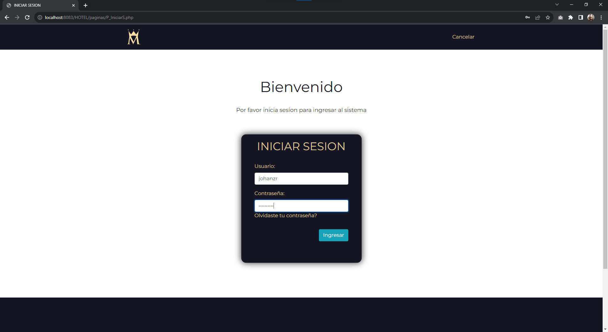

Al ingresar se vera un mensaje de bienvenida y el menu principal.


#### Mantenimiento
En este apartado se pueden realizar las actualizaciones y creacion de registros en catalagos como habitaciones, empleados, servicios y clientes.

###### Habitaciones
Para el registro de habitaciones el formulario nos pediria inidicar el numero (max 3 digitos), el piso, seleccionar el tipo, una descripcion y el precio por noche de la habitacion. Para guardar los valores hay que dar click en el boton registar


En el listado de habitaciones podemos filtrar por piso y aqui podemos ver la habitacion regsitrada, asi mismo aqui tendra un boton para editar la infromacion de la habitacion
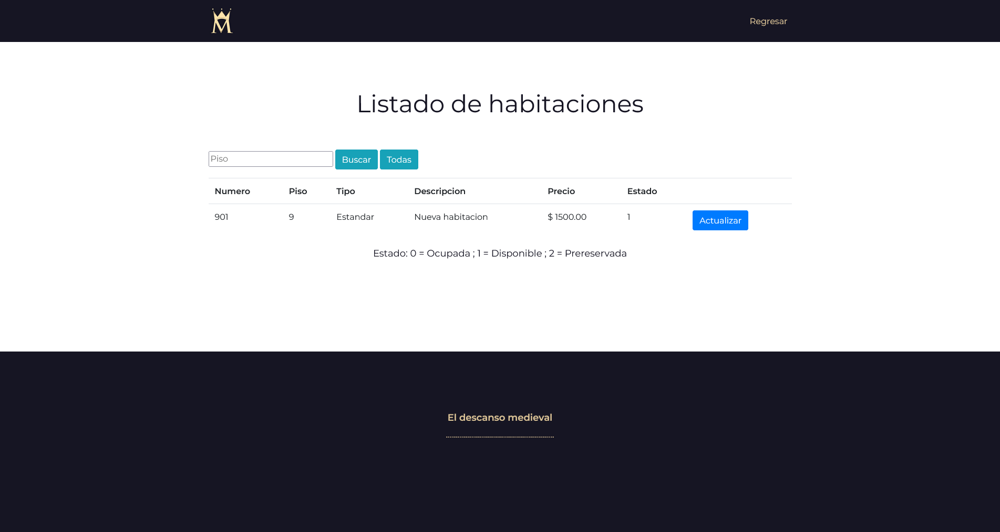

###### Servicios
Para el registro de servicios el formulario nos pediria inidicar el nombre, una descripcion y el precio del servicio. Para guardar los valores hay que dar click en el boton registar
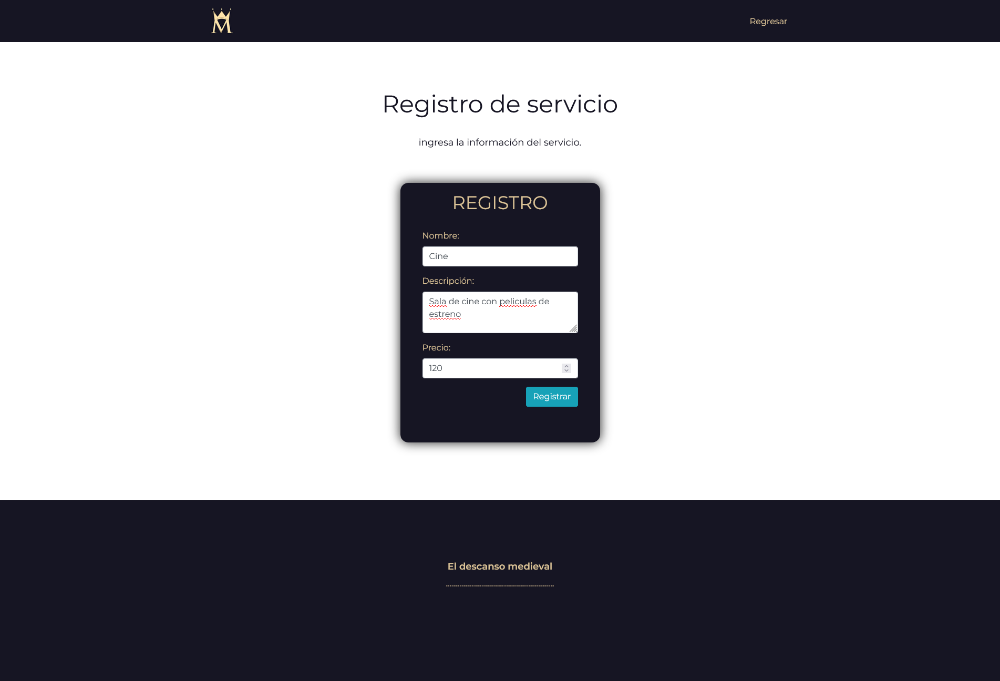

En el listado de servicios podemos filtrar por id o listar todos y aqui podemos ver el servicio regsitrado, asi mismo aqui tendra un boton para editar la infromacion del servicio.
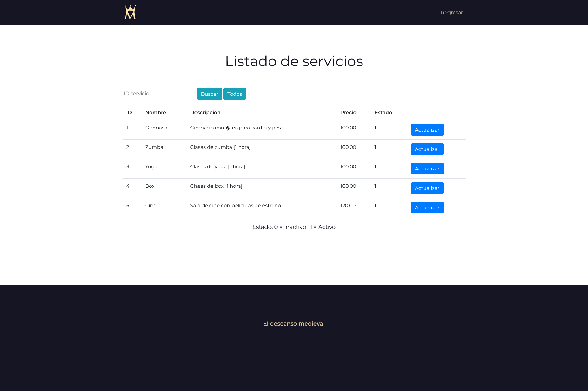

###### Empleados
Para el registro de empleados el formulario nos pediria inidicar el nombre, appelidos, domicilio, telefono, email, puesto, usuario (debe ser de 7 caracteres), constraseña, pregunta y respuesta de seguridad. Para guardar los valores hay que dar click en el boton registar, est actividad solo la pueden llevar a cabo usuarios con el puesto de gerente (G)
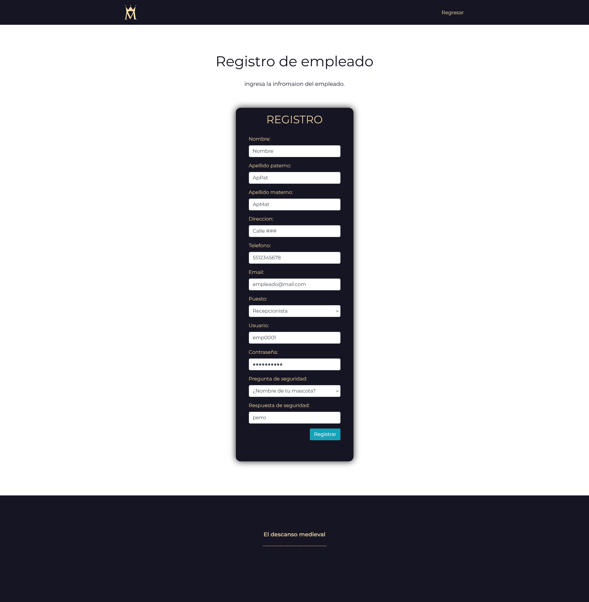

En el listado de empleados podemos filtrar por id o listar todos y aqui podemos ver el empleado regsitrado, asi mismo aqui tendra un boton para editar la infromacion del empleado.
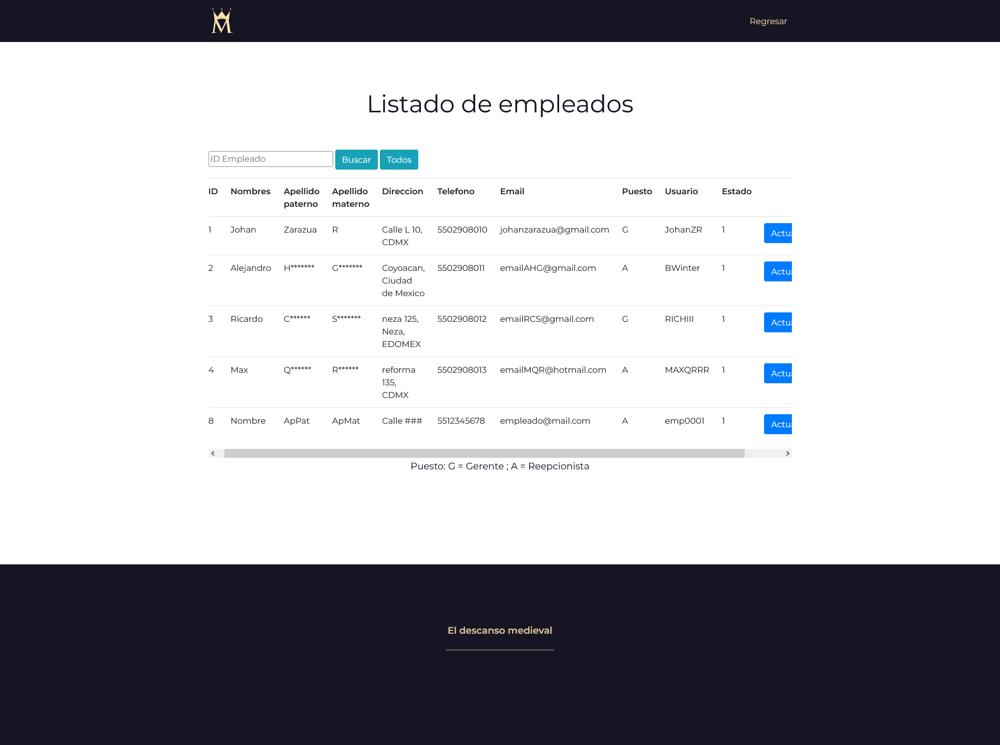

###### Clientes
Aqui podemos ver el listado de todos los clientes que estan registrados en sistema, ademas de que podemos actualizar sus datos. Esta vista es importante ya que para realizar una reservacion se solicta el nombre y apellidos del cliente que pretende reservar.
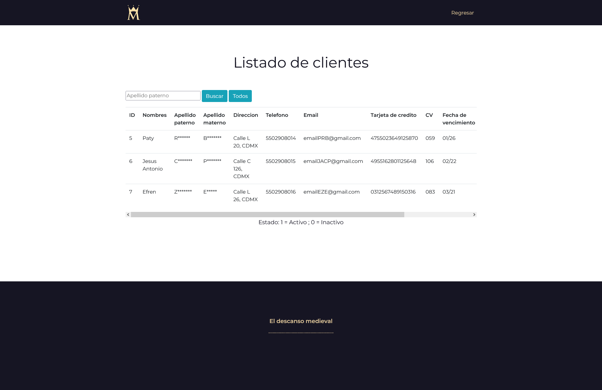

#### Reservacion

###### Agregar reservacion
Para crear una nueva reservacion se debera indicar las fechas de llegada y salida, una vez que se indican se mostrara el listado de habitaciones disponibles para esa fecha, se podra seleccionar una y llenar los datos del formaulario, los cuales unicamemte son el nombre y apellidos del cliente (previamen te registrado)
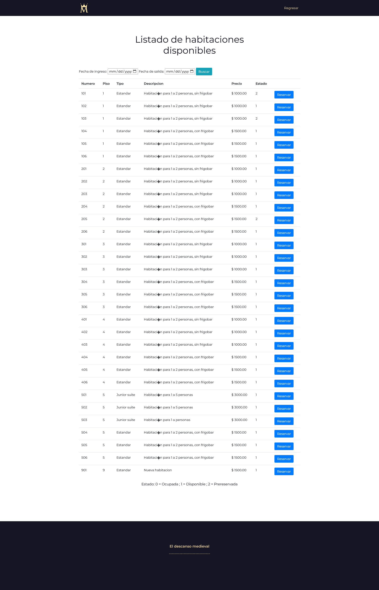
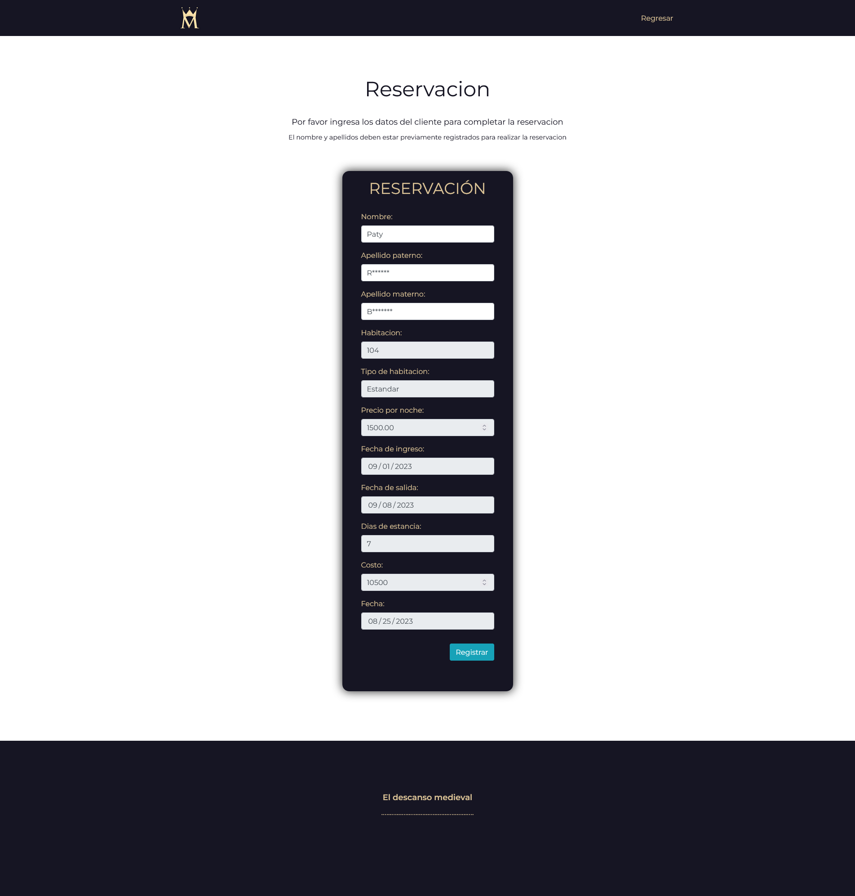


###### Agregar servicios
En este apartado se pueden agregar servicios adicionales a una reservacion, por defecto al seleccionar un servicio automaticamnete se agregara para todos los dias de la reservacion por lo que el monto total del servicio sera igual al costo del servicio multiplicado por los dias de estancia.
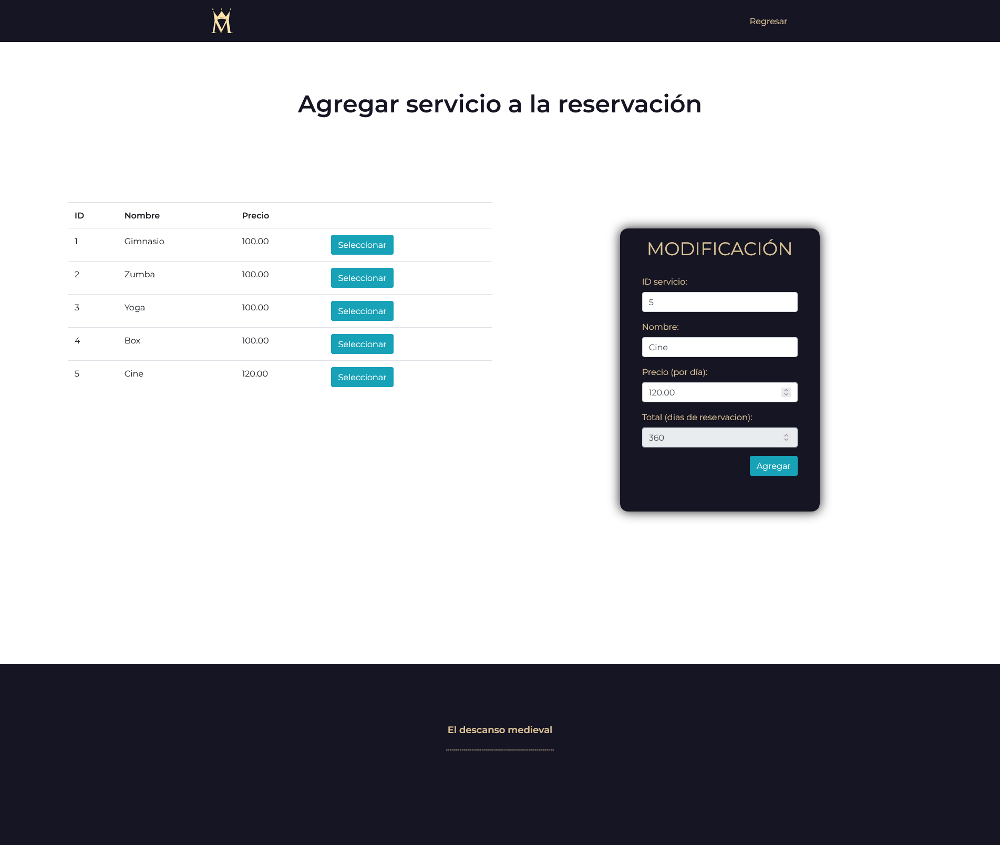


#### Pago
En este apartado se pueden realizar pagos a las reservaciones existentes. Para liquidar el monto total de la reservacion (precio hbaitacion mas servicios) se pueden hacer multiples pagos hasta llegar al monto total, el formulario se actualiza con cada pago registrado y no permite hacer un pago mayor al monto adeudado.
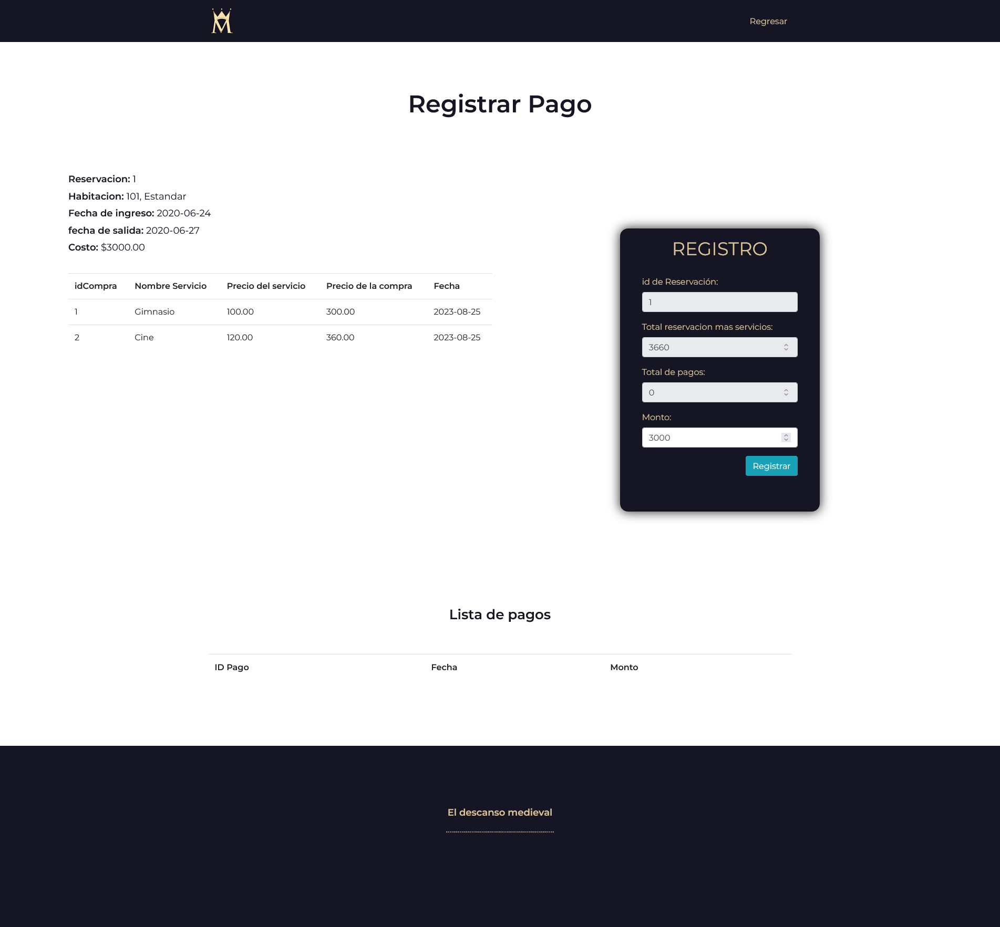
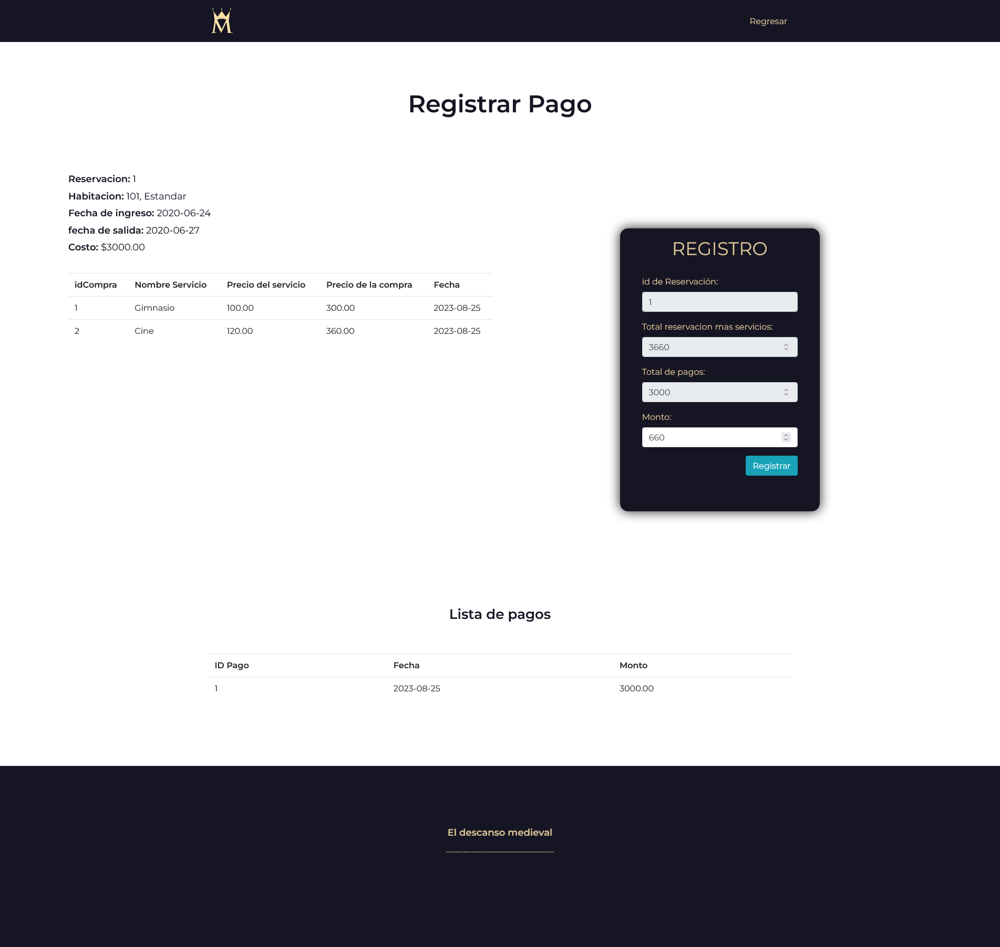


## Mejoras
---

El sistema cuenta con una gran cantidad de cosas que se pueden mejorar, algunas de ellas son
- Cifrar preguntas de seguridad
- Mejorar vistas y agregar nuevas para hacer mas sencillo el uso
- Agregar pasarelas de pago como paypal, mercadopago, etc
- Automatizar el cambio de estatus de las habitaciones al terminar una reservacion
- Envio de notificaciones por email